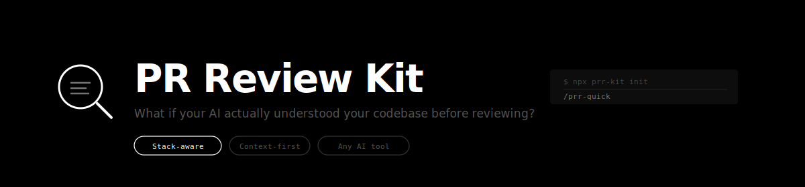
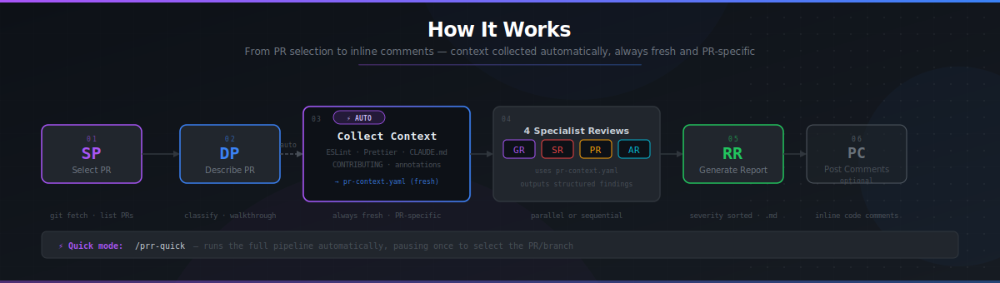

# PR Review Kit

<p align="center">
  
</p>

[](https://www.npmjs.com/package/prr-kit)
[](LICENSE)
[](https://nodejs.org)
[](https://prrkit.sitenow.cloud)
[](https://prrkit.sitenow.cloud/docs)

> AI-driven Pull Request code review — structured, multi-perspective, actionable.

Module system, agent YAML, step-file workflows, CLI installer with full IDE integration.

**[🌐 Website](https://prrkit.sitenow.cloud)** **[📖 Full Documentation](https://prrkit.sitenow.cloud/docs)**

## Quick Start

```bash
# Install into your repo (interactive — recommended)
npx prr-kit install

# Or use the alias
npx pr-review install

# Silent install with all defaults
npx prr-kit install --directory /path/to/repo --modules prr --tools claude-code --yes
```

Then open your IDE in the installed project and use one of these commands to start:

- `/prr-quick` — one command, full pipeline (select PR → review → report)
- `/prr-master` — full menu with all options

## How It Works

<p align="center">
  
</p>

The framework installs into your project as a `_prr/` folder. Agents and workflows are Markdown/YAML files that your AI IDE reads and executes — no server, no background process, no API keys required beyond your IDE's AI.

## Configuration

The installer handles configuration interactively — no manual file editing required. During `npx prr-kit install`, you'll be prompted for your name, language, output folder, target repo, and platform.

All values are written automatically to `_prr/prr/config.yaml`:

```yaml
user_name: YourName
communication_language: English
target_repo: .
platform: auto                        # auto-detect from git remote
platform_repo: "owner/repo"           # optional — needed for PR listing and inline comments
review_output: /abs/path/_prr-output/reviews

context_collection:
  enabled: true
  mode: pr-specific                   # always fresh, never cached

external_sources:
  enabled: false                      # set true to activate MCP + RAG enrichment
```

> See **[CONFIGURATION.md](CONFIGURATION.md)** for the full schema reference — including MCP tool intents, RAG systems, inline annotations, and URL sources.

## Platform Support

| Feature | None / Local | GitHub | GitLab | Azure DevOps | Bitbucket |
|---------|:---:|:---:|:---:|:---:|:---:|
| Core review (diff analysis) | ✅ | ✅ | ✅ | ✅ | ✅ |
| Auto-detect platform from remote URL | — | ✅ | ✅ | ✅ | ✅ |
| List open PRs/MRs | ❌ | ✅ `gh` | ✅ `glab` | ✅ `az` | ✅ `bb` |
| Select PR by number (auto base/head) | ❌ | ✅ | ✅ | ✅ | ✅ |
| Load diff via platform CLI | ❌ | ✅ `gh pr diff` | ✅ `glab mr diff` | ⚠️ git fallback | ⚠️ git fallback |
| Post inline code comments | ❌ | ✅ Reviews API | ✅ MR discussions | ✅ PR threads | ✅ REST API |
| Post summary review | ❌ | ✅ | ✅ | ✅ | ✅ |
| Review verdict (approve / request changes) | ❌ | ✅ | ✅ | ✅ | ❌ |
| Required CLI | — | `gh` | `glab` | `az` + extension | `bb` / curl |

> **None / Local mode**: all review analysis runs locally via `git diff` — no platform CLI required. Findings are saved to `_prr-output/reviews/` only.

## Review Workflow

### Quick mode — one command, full pipeline

```
/prr-quick    or    /prr-master → QR
```

Runs automatically: **select PR → describe → collect context → 5 reviews → generate report**
Only pauses once to ask which PR/branch to review.

### Manual mode — step by step

| Code | Command | Description |
|------|---------|-------------|
| `SP` | Select PR | Fetch latest → list open PRs (via `gh`) or branches → select head + base → load diff |
| `DP` | Describe PR | Classify PR type, generate summary, file-by-file walkthrough |
| `GR` | General Review | Logic, naming, readability, DRY, best practices |
| `SR` | Security Review | OWASP Top 10, secrets, auth, rate limits, injection |
| `PR` | Performance Review | N+1 queries, memory leaks, async patterns, caching |
| `AR` | Architecture Review | SOLID, layers, coupling, consistency with codebase |
| `BR` | Business Review | User impact, business risk, feature completeness, data safety, observability |
| `IC` | Improve Code | Concrete BEFORE/AFTER code suggestions |
| `AK` | Ask Code | Q&A about specific changes in this PR |
| `RR` | Generate Report | Compile all findings → Markdown report in `_prr-output/reviews/` |
| `PC` | Post Comments | Post inline code comments to GitHub PR via `gh` Reviews API |
| `PM` | Party Mode 🎉 | All reviewers in one collaborative session |
| `CL` | Clear | Remove context files and/or review reports from output folder |
| `HH` | Help | Show this guide |

### Selecting a PR (SP step)

**With `platform_repo` configured** — lists open PRs/MRs via platform CLI:
```
#45  "Add OAuth2 login"      feature/oauth → main    @alice  3h ago
#44  "Fix memory leak"       fix/memory    → main    @bob    1d ago
```
Enter PR number → base and head resolved automatically.

**Without `platform_repo`** — asks explicitly for both branches:
```
🎯 Head branch (the branch to review)?
   • Enter a number from the list  (e.g., 1)
   • Type the branch name directly  (e.g., feature/my-feature)

🎯 Base branch (what to diff against)?
   • Press Enter for default [main]
   • Type the branch name directly  (e.g., develop)
```

## Review Agents

| Agent | Slash Command | Speciality |
|-------|--------------|------------|
| PRR Master | `/prr-master` | Orchestrator — routes all workflows, full menu |
| PRR Quick | `/prr-quick` | One-command full pipeline (select → review → report) |

Specialist reviewer agents are orchestrated internally by the master agent and party-mode workflow. Use `[PM] Party Mode` from the master menu to run all reviewers in a collaborative session.

## Reviewers at a Glance

| Reviewer | Focus | Key questions |
|---|---|---|
| 👁️ General (GR) | Code quality | Is the logic correct? Naming clear? DRY? Tests present? |
| 🔒 Security (SR) | OWASP Top 10 | XSS? Injection? Secrets exposed? Auth correct? |
| ⚡ Performance (PR) | Efficiency | N+1 queries? Memory leaks? Missing await? |
| 🏗️ Architecture (AR) | Structure | Layer violations? Coupling? Consistent with codebase? |
| 💼 Business (BR) | Real-world impact | User impact? Business risk? Feature completeness? Data safe? Observability? |

**Business Review (BR)** runs last and translates technical findings into business language — user impact, GDPR risk, migration safety, deployment recommendations, and post-ship monitoring checklist.

## Severity Levels

All findings use a standard format:

- 🔴 **[BLOCKER]** — Must fix before merge
- 🟡 **[WARNING]** — Should fix (with explanation)
- 🟢 **[SUGGESTION]** — Nice-to-have improvement
- 📌 **[QUESTION]** — Needs clarification from author

## Context Collection

After [DP] Describe PR, context is collected **automatically** — no manual step needed:

1. Analyzes changed files to detect domains (`authentication`, `state-management`, etc.)
2. Reads relevant config files (`.eslintrc`, `.prettierrc`, `tsconfig.json`) and standards docs (`CONTRIBUTING.md`, `ARCHITECTURE.md`)
3. Extracts inline `@context:` / `@security:` / `@pattern:` annotations from the diff
4. Optionally queries **MCP tools** (Confluence, Jira, Figma) and **RAG systems** if configured
5. Writes `pr-{branch}-context.yaml` — loaded by all reviewers

> See [CONFIGURATION.md](CONFIGURATION.md) for MCP intents, RAG setup, and URL sources.

## Inline Code Comments

When `[PC] Post Comments` is run with `platform_repo` configured, it posts findings as **inline code comments** on the exact file and line — the same experience as a human reviewer.

| Platform | Method | Required CLI |
|----------|--------|-------------|
| GitHub | Reviews API | `gh auth login` |
| GitLab | MR Discussions API | `glab auth login` |
| Azure DevOps | PR Threads API | `az login` |
| Bitbucket | Inline Comments REST API | `bb` / `curl` |

## Supported IDEs

Antigravity, Auggie, Claude Code, Cline, Codex, Crush, Cursor, Gemini CLI, GitHub Copilot, iFlow, Kilo, Kiro, OpenCode, QwenCoder, Roo Cline, Rovo Dev, Trae, Windsurf

## Requirements

- Node.js 20+
- Git
- Platform CLI (optional — only needed for PR listing and inline comments):
  - GitHub: [`gh`](https://cli.github.com/)
  - GitLab: [`glab`](https://gitlab.com/gitlab-org/cli)
  - Azure DevOps: [`az`](https://learn.microsoft.com/en-us/cli/azure/) + Azure DevOps extension
  - Bitbucket: [`bb`](https://bitbucket.org/atlassian/bitbucket-cli) or `curl`

## Development

```bash
npm install
npm test
```

## Project Structure

```
prr-kit/
├── src/
│   ├── core/
│   │   ├── agents/
│   │   │   └── prr-master.agent.yaml   # Master orchestrator + menu
│   │   └── tasks/
│   │       ├── help.md                 # [HH] Help
│   │       ├── clear.md                # [CL] Clear output files
│   │       └── workflow.xml            # Workflow engine rules
│   └── prr/
│       ├── agents/                     # Specialist reviewer agents (GR SR PR AR)
│       ├── config-template.yaml        # Full config template with all options
│       └── workflows/
│           ├── 1-discover/             # [SP] Select PR
│           ├── 2-analyze/
│           │   ├── describe-pr/        # [DP] Describe PR
│           │   └── collect-pr-context/ # Auto: build PR-specific knowledge base
│           ├── 3-review/
│           │   ├── general-review/     # [GR] Logic, naming, DRY
│           │   ├── security-review/    # [SR] OWASP, secrets, auth
│           │   ├── performance-review/ # [PR] N+1, async, memory
│           │   ├── architecture-review/# [AR] SOLID, layers, coupling
│           │   └── business-review/    # [BR] User impact, risk, completeness
│           ├── 4-improve/              # [IC] Improve Code
│           ├── 5-ask/                  # [AK] Ask Code
│           ├── 6-report/               # [RR] Report + [PC] Post Comments
│           └── quick/                  # [QR] Full pipeline in one command
├── tools/
│   └── cli/                            # CLI installer + IDE handlers
├── test/                               # Schema + component tests
├── CONFIGURATION.md                    # Full config reference (MCP, RAG, context)
└── docs/
    └── assets/
        ├── banner.svg
        └── how-it-works.svg
```

---

## Support the Project

PR Review Kit is free for everyone — and always will be. If you'd like to support development:

- ⭐ **Star on GitHub** — Click the star icon near the top right of this page
- ☕ **[Buy Me a Coffee](https://buymeacoffee.com/mrquangthay)** — Fuel the development

---

## Contributing

Contributions are welcome! See [CONTRIBUTING.md](CONTRIBUTING.md) for guidelines on adding workflows, reviewer agents, IDE integrations, and more.

## License

[MIT](LICENSE) © mrquangthai278
